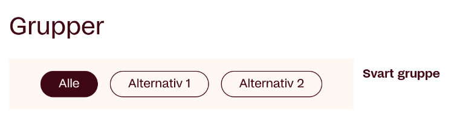

+++
title = "Uke 34"
date = 2025-08-24
author = "simsine"
+++

> Timer  denne uka: 17
>
> Timer totalt: 17

# Onsdag - 7.5 timer - 09:00-16:30

## Start på dagen og intro
Startet dagen kl 09:00 og ble tildelt eget nøkkelkort for tilganger i bygget. Jeg fikk så introdusert meg selv til noen av de jeg skal jobbe med. Da jeg startet var det allerede satt opp jobb-laptop med Ubuntu installert, noe som var veldig greit ettersom jeg foretrekker å kjøre linux på mine egne maskiner for utvikling og serverdrift til vanlig. Etter det installerte jeg system-pakker og programmer på maskinen. 
- Cargo - Package manager for programmeringsspråket Rust 
- git
- VSCode

Jeg fikk så opprettet brukerkontoer og to-trinns autentisering på de ulike tjenestene jeg skal bruke for kommunikasjon og samarbeid.

- Epost
- Github Enterprise
- Slack
- TeamCity
- Figma

## Lunsj og Systemknuten prosjektet
Kl 11.00 er det lunsj i kantina på avdelingen og mulighet for å snakke med flere på teamet.
Etterpå får jeg mer info om prosjektet Systemknuten som er en side for å gi overblikk over de ulike eksterne og interne tjenestene i Frende. Dette kan være brukerrettede applikasjoner, APIer eller databaser. Behovet for dette prosjektet kommer av krav om at bedriften skal ha en oversikt over den store mengden tjenester de drifter.

## Slutt på dagen og møte
Mot slutten av dagen ble jeg invitert med på møte om design av Systemknuten applikasjonen. På møtet diskuteres design dokumentet og videre valg av design.

## Det tekniske
Applikasjonen er skrevet i Rust og bruker web-rammeverket Axum. 
Hele siden er generert på server-siden og bruker ingen Javascript på frontenden.
Rust er et ganske spennende programmeringsspråk som i tillegg til å ha en litt uvant syntaks også tvinger deg til å tenke på en ganske annerledes måte enn med for eksempel Java. I tillegg til å være ‘strongly typed’ må man også ta hensyn til levetiden og eierskapet av variabler. Dette er fordi i forhold til Java som bruker en garbage collector for å allokere og frigi minne bruker Rust noe som heter ‘borrow-checking’. Borrow checkeren til Rust passer på at en variabel bare er tilgengelig for riktig eier og at den frigis når den går ut av scope. Dette tvinger deg til å oppgi hvilke funksjoner og scopes som skal ha tilgang til variablene. Rust tvinger deg også til å håndtere alle feiltilfeller som kan oppstå, noe vi vil støte på senere.


# Torsdag - 5.5 timer - 10:30-16:00

## Query params i Axum
For å implementere filtreringen på tagger er vi nødt til å sende query parametre for å bestemme hvilke filtre som skal være aktive. Jeg begynner dagen med å se på hvordan man håndterer query parametre i Axum og støter ganske raskt på problemer. Jeg prøver nemlig å hente inn en liste med parametre på den følgende formen.

```
http:localhost/?f=a&f=b
```

Dette ønsker jeg så å serialisere som en liste med strenger på backenden på den følgende måten.

```rust
pub struct Params {
	#serde(rename="f")
	filter_query: Option<Vec<String>>
}
```

I route-handleren vil vi da forvente å kunne extracte disse parametrene med Query-extractoren.

```rust
async fn hello_route(
   Query(params): Query<HelloParams>,
) -> Response {
   dbg!(params.filter_query);
   …
}
```

Dette fungerer ikke som forventet i Axum pakken eller 'craten' som det heter i Rust. Hvorfor de ikke støtter det direkte vet jeg ikke, men etter litt søking på nettet finner jeg ut at Axum har en ekstra crate kalt ‘axum-extra’ som inneholder en ‘drop-in-replacement’ Query() extractor funksjon som støtter parsing av lister fra query paramentrene. Jeg bytter derfor importen av Query() til ‘axum-extra’ og det fungerer som forventet.


# Fredag - 4 timer - 10:30-14:30 

Mesteparten av dagen gikk til å implementere CSS styling for filtrerings knappene. For dette tok jeg inspirasjon fra det interne design dokumentet i Figma, men også fra Frende sitt offentlige designsystem [Frøya](https://design.frende.no). Dette designsystemet inneholder et komponent-bibliotek for vanlige webkomponenter. Jeg tok derfor inspirasjon fra filter button komponenten for bruk i applikasjonen.



Gjennom dette fikk jeg også testet ut å bruke en CSS stil som baserer seg på bruk av semantisk styling over bruk av klasser. Dette gjør at man kan skrive ren semantisk HTML uten CSS-klasser i dokumentet. 
Jeg fikk også testet ut CSS nesting og nesting selektoren &. Dette er overraskende nok et relativt nytt konsept innen CSS og har bare vært støttet i de fleste nettlesere [siden sent i 2023](https://caniuse.com/css-nesting). Disse to konseptene passer bra sammen og lar oss skrive korte og konsise CSS dokumenter. 

Her er et eksempel på hvordan CSS nesting ser ut.

```css
p {
  font-family: system-ui;
  font-size: 1.2rem;
  & > a {
    color: tomato;
    &:hover,
    &:focus {
      color: ivory;
      background-color: tomato;
    }
  }
}
```
