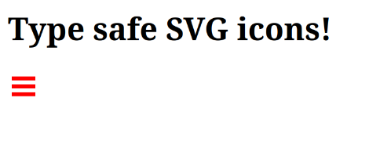

+++
title = "Uke 37"
date = 2025-09-14
author = "simsine"
+++


> Timer denne uka: 12,5
> 
> Timer totalt: 56

# Onsdag - 7 timer - 09:00-16:00

# Type-sikre SVG ikoner i Rust

Jeg startet dagen med å lage CSS for kategori knappene, dette var ganske straight-forward å implementere ut ifra design dokumentet i Figma. Etter å ha ordnet opp i det begynner jeg å se på hvordan jeg kan løse problemet med å kunne sette fargen på SVG ikoner i CSS. Ender også opp med å diskutere med en kollega hvordan dette kan løses og hvordan selve kategoriene skal defineres i koden. Vi ender opp med å ha en veldig informativ samtale og jeg får en del ideer for hvordan jeg kan implementere det.

Ettersom SVG-er som er importert i HTML gjennom en img tag har begrenset mulighet til å bli endret av CSS-styles ser jeg på andre gode alternativer. Jeg kommer frem til at dette kan løses med å inkludere SVG koden direkte i markup, dette kan gjøres i maud makroen ved å inkludere innholdet direkte i markup. Jeg får derfor ideen av å lage en egen Enum type for SVG ikonene som importerer innholdet av filene direkte. Dette gjør at koden er lett å utvide når man skal legge til nye ikoner.

```rust
pub enum SVG {
   BurgerMenu,
}

impl hypertext::Renderable for SVG {
   fn render_to(&self, buffer: &mut String) {
       buffer.push_str(match self {
           SVG::BurgerMenu => include_str!("../static/svg/burger.svg"),
       })
   }
}
```

Man kan så enkelt inkludere ikonene i maud makroen for å rendres til html.

```rust
async fn svg() -> Response {
   maud!(
       html {
           link rel="stylesheet" href="/static/svg/svg.css";
       }
       h1 {"Type safe SVG icons!"}
       (SVG::BurgerMenu)
   ).render().into_response()
}
```

Legger man så til css regler for SVG'en og setter `stroke="currentColor"` i SVG filene kan man endre fargen på de i koden.

```css
svg {
   color: red;
}
```




# Torsdag - 5.5 timer - 10:30-16:00

I dag startet jeg dagen med å være med på et avdelingsmøte som blir kalt “Fot i bakken” hvor man får mulighet til å fortelle hva man selv jobber med for tiden og høre på hva de andre jobber med. Jeg fikk introdusert meg selv for de andre og nevnt litt om at jeg jobbet sammen med Team Infra og at jeg kodet på en ny applikasjon for oversikt over systemene som driftes av Frende. Resten av møtet satt jeg og hørte på andre jobbet på av små og store prosjekter, men jeg må innrømme at det var litt vanskelig å følge med på ettersom jeg ikke er blitt så kjent med de andre utviklingsprosjektene og fordi det var en stor mengde forkortelser og uttrykk jeg ikke var kjent med betydningen av.

Så etter det møtet startet jeg på utviklingen av en feature for å kunne filtrere systemer på ferdigsatte kategorier i applikasjonen. Her ble det litt frem og tilbake med hvordan det var best å implementere dette ettersom kategoriene helst burde være av en Enum type for å være gjenbrukbare, men også at kategoriene må ha en viss fastsatt rekkefølge. Jeg kom til slutt frem til at det var best å bruke Enums sammen med strum craten som blant annet inneholder makroer for å iterere over Enums.
